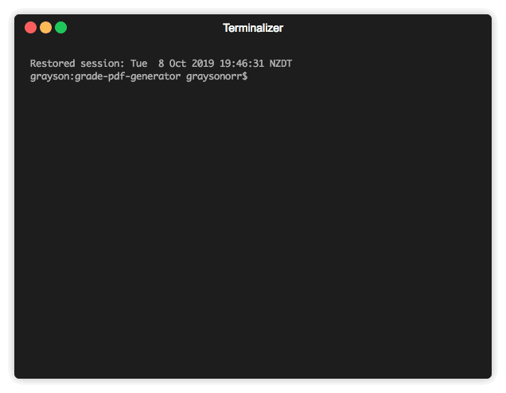

# Grade PDF Generator

[](https://travis-ci.org/Grayson-Orr/grade-pdf-generator) [](https://coveralls.io/github/Grayson-Orr/grade-pdf-generator?branch=master) [](https://opensource.org/licenses/MIT) [](https://mergify.io)


## Dropbox Access Token

## Config

```json
{
  "email": "",
  "password": "",
  "dropbox-access-token": ""
}
```

## Scripts

### PDF

#### Interactive Mode

```javascript
npm run start
```



#### Generate PDF Files

```javascript
node generate.js <filename>.csv
```

#### Merge PDF Files

```javascript
node merge.js <filename>.json
```

#### Send PDF Files

```javascript
node send.js <filename>.json
```

#### Test

```javascript
npm run test
```

### Dropbox

#### Upload PDF Files

```javascript
node dropbox_upload.js <course name>
```
